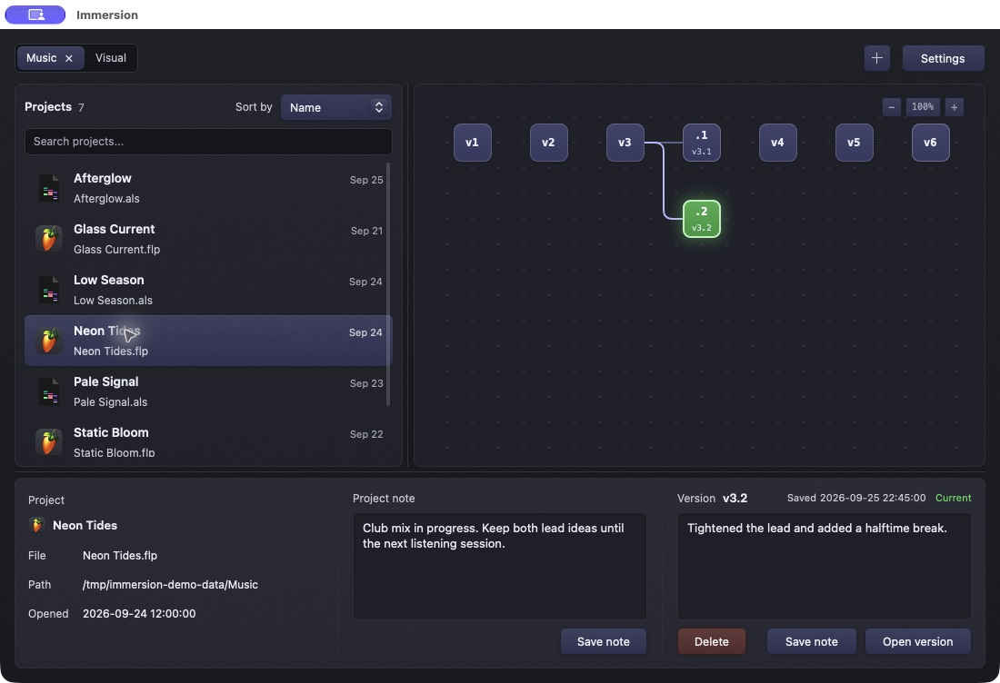

  
  <h1>Immersion</h1>
  
<strong>A visual history for your creative projects.</strong>

  
Immersion watches your project folders, saves versions as you work, and lets you return to an earlier version from a visual graph.

## At a glance

| | |
| --- | --- |
| **Made for** | Music, video, design, and other supported creative project formats |
| **Works on** | macOS and Windows releases; [Linux builds](packaging/linux/README.md) |
| **What it saves** | Project files and selected companion data; large media and caches are generally excluded |
| **Price and source** | Free and open source under [GPLv3](LICENSE) |

Choose where your projects live and whether they are kept in their own folders or as loose files. Immersion finds supported projects, takes an initial snapshot, then records new versions when their files change. Search and sort projects, add notes to projects and versions, and restore a version when you need it. Your history stays in a `.musit` folder beside the project.

## A look inside

These screenshots show Immersion with illustrative sample projects and version notes.

## Get started

1. Download the latest [macOS DMG or Windows installer](https://github.com/404oops/immersion/releases/latest).
2. Open Immersion and choose a projects folder.
3. Select **Bundles** for one folder or bundle per project, or **Files** for loose project files. You can add more folders later with **+**.
4. Select a project to explore its version graph. Double-click a project to open it in its usual app.

The [user manual](wiki/Home.md) covers every control, supported formats, storage, restore behavior, settings, and troubleshooting. Once published, it is also available in the [GitHub Wiki](https://github.com/404oops/immersion/wiki).

> Immersion versions project data, not an entire media library. Keep your normal backups for audio, video, assets, and the device that holds your projects.

## Contribute

Bug reports and feature requests are welcome in [Issues](https://github.com/404oops/immersion/issues). To build locally, install Rust and run `cargo run -p immersion`; run the engine tests with `cargo test -p musit-core`. The manual's [development page](wiki/Development.md) has the repository layout and packaging details.

Immersion is licensed under the [GNU General Public License, version 3](LICENSE).
