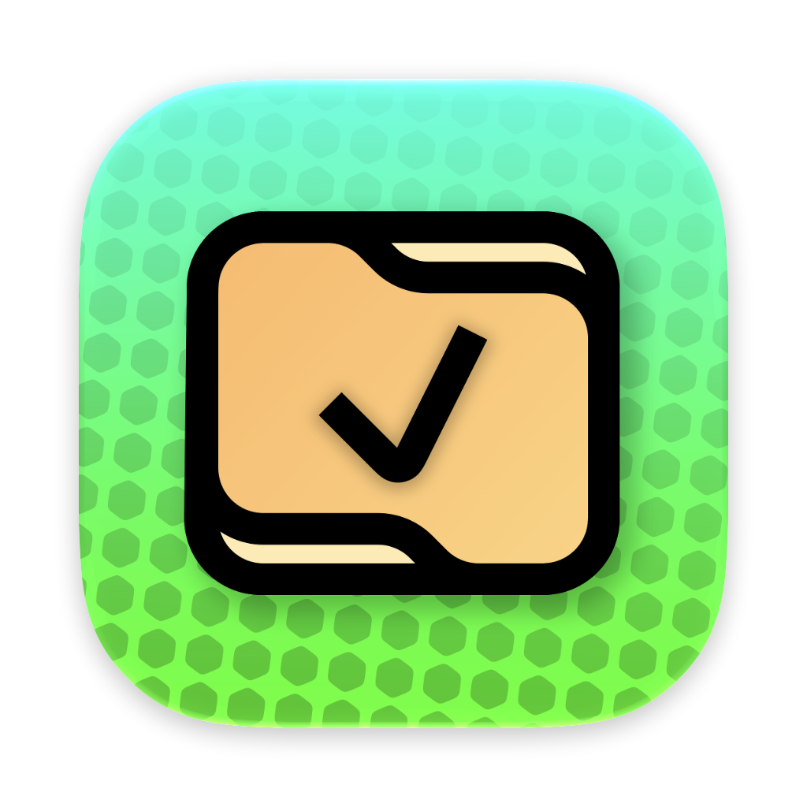
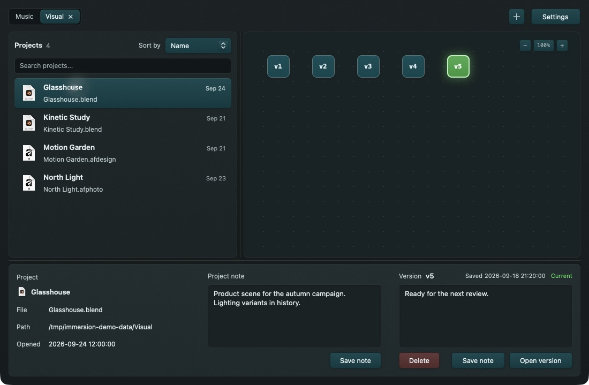

  
  <h1>Immersion</h1>
  
<strong>A visual history for your creative projects.</strong>

  
Immersion watches your project folders, saves versions as you work, and lets you return to an earlier version from a visual graph.

## At a glance

| Detail | Information |
| --- | --- |
| **Made for** | Music, video, design, and other supported creative project formats |
| **Release packages** | macOS 12+ on Apple silicon; Windows x64 and ARM64; [experimental Linux builds](wiki/Linux.md) (unsupported) |
| **What it saves** | Project files and some related files; large media and temporary files are usually skipped |
| **Price and source** | Free and open source under [GPLv3](LICENSE) |

Point Immersion at a folder of projects and tell it how they are organized. It finds the project files it recognizes and tries to save a first version of each one. While Immersion is running, it saves new versions when those files change. You can find a project, add notes, and go back to an earlier version. Immersion keeps the saved versions in a `.musit` folder alongside the project files. Files in the same folder share that `.musit` folder.

## A look inside

These screenshots show Immersion with illustrative sample projects and version notes.

## Get started

1. Download an available package from the latest [release](https://github.com/404oops/immersion/releases/latest). For Linux build and package options, see the guide below.
2. Open Immersion and choose a projects folder.
3. Choose **Bundles** if each project has its own folder, or **Files** if each project is a separate file. You can add more folders later with **+**.
4. Select a project to explore its version graph. Double-click a project to open it in its usual app.

Linux builds are provided so Immersion can run on Linux. If you use one, you are responsible for diagnosing and fixing any issues yourself; the project does not provide Linux troubleshooting or fixes. For installation and build options, including Flatpak, see the [Linux build guide](wiki/Linux.md).

If Apple or Microsoft has ended support for your version of macOS or Windows, Immersion does not support it either. macOS 12 is the oldest version the app can install on; that does not mean every version from macOS 12 onward is supported.

The [user manual](wiki/Home.md) covers every control, supported formats, storage, restore behavior, settings, and troubleshooting.

> Immersion does not back up your whole project or media library. Keep separate backups of your audio, video, other assets, and computer or drive.

## Contribute

Bug reports and feature requests for supported platforms are welcome in [Issues](https://github.com/404oops/immersion/issues). To build locally, install Rust and run `cargo run -p immersion`; run the engine tests with `cargo test -p musit-core`. The manual's [development page](wiki/Development.md) has the repository layout and packaging details.

Immersion is licensed under the [GNU General Public License, version 3](LICENSE).
