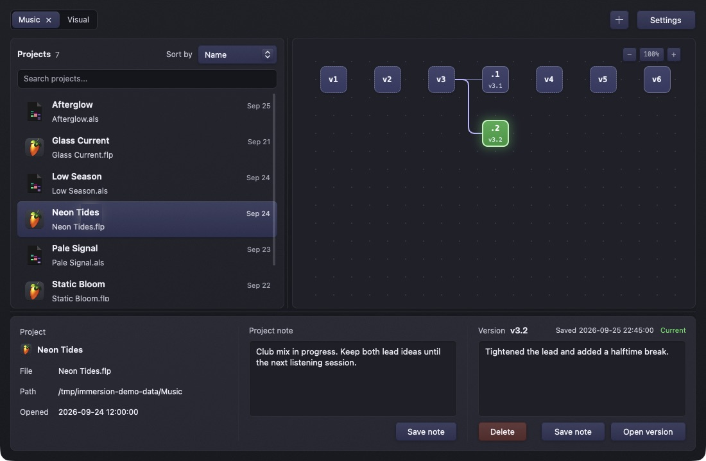

# Immersion user manual

Immersion watches folders containing creative projects, records versions of supported project files, and shows their history as a graph. This manual describes version 0.2.2.

*Illustrative sample projects. The history, project note, and version note are shown in the real app.*

## Start here

1. [Install and set up a folder](https://github.com/404oops/immersion/wiki/Getting-Started)
2. [Find your way around the window](https://github.com/404oops/immersion/wiki/Interface)
3. [Understand snapshots and restore a version](https://github.com/404oops/immersion/wiki/Versions-and-Restoring)

## Reference

- [Settings, storage, and background behavior](https://github.com/404oops/immersion/wiki/Settings-and-Storage)
- [Supported projects and folder layouts](https://github.com/404oops/immersion/wiki/Supported-Projects)
- [Troubleshooting and frequently asked questions](https://github.com/404oops/immersion/wiki/Troubleshooting)
- [Building and contributing](https://github.com/404oops/immersion/wiki/Development)

**A snapshot is not a full backup.** Immersion normally saves project files and selected companion files, while large media and cache folders are excluded. Keep separate backups of your projects and media.
