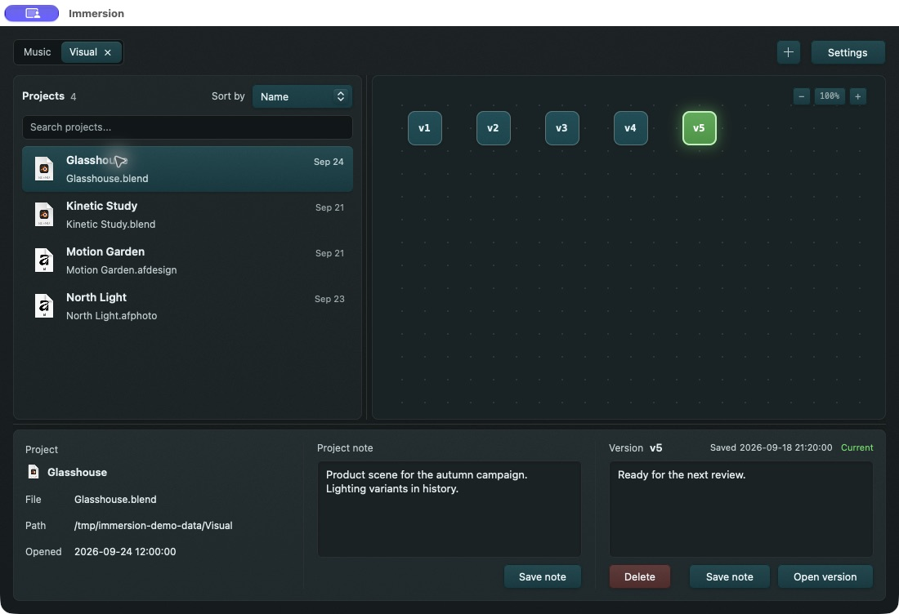

# The main window

The window has folder tabs across the top, a project list on the left, a version graph on the right, and a details panel below. Drag the dividers to give the list, graph, or details more room.

## Folder tabs

- Select a tab to work with that folder. All added folders continue to be watched, even when their tab is not selected. A tab can show scanning or queued progress.
- Select **+** to add a folder. A new folder asks for its layout; an existing configured folder reuses its saved layout.
- Double-click a tab name to rename it. Press **Enter** to save or **Escape** to cancel. Drag tabs to reorder them.
- Use a tab's remove control to stop watching it. Confirming removal leaves its `.musit` version history on disk, so you can add the folder again later.
- Select **Settings** for folder and app preferences.

## Project list

- Click a project to select it; double-click to open its primary file in the associated app.
- Type in **Search projects…** to narrow the visible list.
- Use **Sort by** to switch between **Name** and **Last Opened**. The setting also appears in Settings as the default sort mode.
- The list shows the project type and primary file. If a project is missing, check its format and the folder layout in [Supported projects](https://github.com/404oops/immersion/wiki/Supported-Projects).

## Version graph

- Click a node to select that version. Connected nodes show ancestry, including branches created after a restore. The current on-disk version is highlighted when it matches a saved snapshot.
- Double-click a node to restore it. The **Open version** button in the details panel performs the same restore.
- Drag the graph to pan. Scroll to move around it. Use **−**, **+**, or the percentage control to zoom out, zoom in, or reset to 100%. On a trackpad or mouse, Command/Control plus wheel also zooms.
- A dashed node border means that version's fast uncompressed copy has been compacted. It can still be restored from the compressed object store if its data is present.

## Details panel

- **Project** shows the name, primary file, path, and last opened time. Where there are multiple candidate files, use **File** to select the primary one.
- **Project note** is an editable note for the project. Select **Save note** to keep it.
- **Version** shows the selected version, save time, current status, and its note. Select **Save note** after editing. **Delete** asks for confirmation and permanently removes that version's snapshot. **Open version** restores the selected version.

Project notes and version notes are different: project notes follow the project, while version notes identify one saved point in its history.
