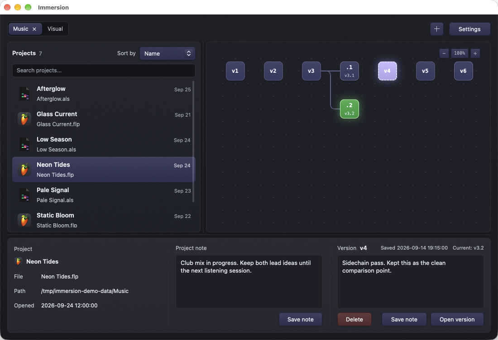

# Versions and restoring

## How a version is made

When Immersion first finds a project, it tries to save a starting version of its main file or bundle. As long as Immersion is running, it saves new versions after changes to supported files settle. The graph shows the history of the selected file or bundle. If several files appear together as one project in Bundles mode, the other files may have separate histories.

Each version has a number and a save time. Immersion avoids storing identical content twice and keeps compressed copies of older versions. Editing a project note does not make a new file version.

Versions are local to your project storage. There is no cloud sync or account. Save notifications can be enabled in Settings on macOS and Linux.

## Current version and branches

**Current** means the files saved in that version match the selected file or bundle on disk now. It does not check every asset in the project folder. If no version says Current, Immersion cannot confirm a match. It may still be waiting to record a recent change, or it may be unable to read a file.

If you restore an older version and then save again, the new versions start a new path in the graph. The earlier history stays visible.

*Illustrative history: v3.1 and v3.2 branch from v3. The selected v4 shows its saved note while v3.2 remains current.*

## Restore a version

1. Save and close the project in its creative app so that the app does not immediately overwrite the restored file.
2. Select the project and the version you want in the graph. Read its timestamp and note in the details panel.
3. Select **Open version**, or double-click the version node.
4. Wait for the restore to finish, then reopen the project in its creative app. Check the activity log in Settings if it fails.

If Immersion cannot tell whether your current file or bundle is already saved, it tries to save it just before the restore. That extra save can fail, and the restore may still continue. Before restoring, make sure your current work appears as a saved version or copy it somewhere else.

Immersion gets all the files from the chosen version ready before replacing anything. If a replacement fails, it tries to put the original files back. Restoring replaces only the files saved in that version, in their original locations. It does not make a separate project copy or remove files added later. Keep a separate backup before major recovery work.

## Delete a version

Select a version, choose **Delete**, and confirm. This permanently removes that saved version. You cannot undo it in Immersion. The other versions remain in the graph. Removing a watched folder is different: it leaves its version history on disk.

## Snapshot retention

**Settings → Snapshot retention** sets how many recent versions keep an extra copy for faster restoring. The default is five per file; you can choose 1–50. When Immersion removes an older quick copy, it keeps the compressed copy. A dashed border in the graph marks a version without a quick copy. You can still restore it if the compressed copy is available. Lowering the setting can remove quick copies that already exist.

## What is covered

Immersion saves the main project file or bundle and, for some formats, a few related files. It usually skips large audio and video files, renders, samples, and temporary files. The exact list depends on the project format; see [Supported projects](Supported-Projects.md). Keep a separate backup of the whole project.
