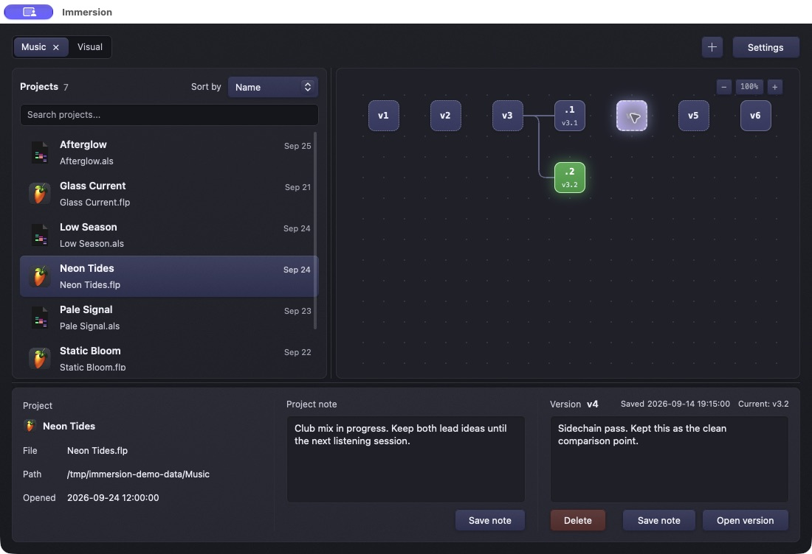

# Versions and restoring

## How a version is made

After a folder is scanned, Immersion seeds an initial version for each supported project it can initialize. While it runs, its file watcher records later project saves after changes settle. The graph displays versions of the selected primary file; each version has an ID and save time. Immersion deduplicates stored content using SHA-256 hashes and compresses older copies. Saving project notes does not create a project-file version.

Versions are local to your project storage. There is no cloud sync or account. A save notification can be enabled in Settings on macOS.

## Current version and branches

**Current** means the files on disk match a saved version. If no saved version matches, you may have unsaved, recently changed, or otherwise modified data on disk. When you restore an earlier version and then save new changes, history branches from the restored version. The graph keeps the older history visible.

*Illustrative history: v3.1 and v3.2 branch from v3. The selected v4 shows its saved note while v3.2 remains current.*

## Restore a version

1. Save and close the project in its creative app so that the app does not immediately overwrite the restored file.
2. Select the project and the version you want in the graph. Read its timestamp and note in the details panel.
3. Select **Open version**, or double-click the version node.
4. Wait for the restore to finish, then reopen the project in its creative app. Check the activity log in Settings if it fails.

Immersion attempts to capture the current on-disk project file first if it does not match a known snapshot. It prepares all files in the chosen version before replacing any of them and attempts to roll back if a swap fails. Even with these safeguards, keep independent backups before major recovery work. A restore replaces the versioned files on disk; it does not launch a separate copy of the project.

## Delete a version

Select the version, choose **Delete**, and confirm. This permanently removes that snapshot from `.musit` and cannot be undone in the app. The remaining graph is reconnected around it. Deleting a version is different from removing a watched folder: removing a folder does not erase history.

## Snapshot retention

**Settings → Snapshot retention** sets how many recent versions keep quick, uncompressed copies per file. The default is five; the allowed range is 1–50. Older versions are compacted into the compressed object store, not intentionally discarded. A dashed graph border identifies a compacted version. Reducing the setting can compact existing staged copies.

## What is covered

Templates include primary project data and, for some formats, selected companion manifests. Large audio, video, rendered media, samples, and caches are usually excluded. The exact file set depends on format; see [Supported projects](https://github.com/404oops/immersion/wiki/Supported-Projects). Immersion is a version history tool, not a replacement for a complete filesystem backup.
